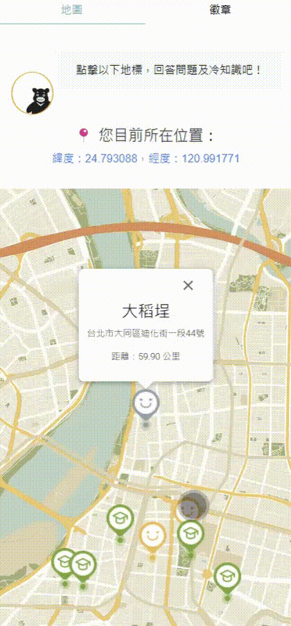

# 臺北尋奇 (Taipei City Cultural Explorer)

Taipei City Cultural Explorer is a map-based microservice designed to work with the **Taipei City Pass** platform. This project aims to help residents and visitors discover the rich history and culture of Taipei through interactive map experiences and a collectible badge system.

## Demo


## Motivation

We observed that many Taipei residents rarely have the time or motivation to deeply explore the city's cultural and historical landmarks. To address this, we created **臺北尋奇**, a microservice that encourages cultural discovery through **fun quiz interactions** and a **badge-collecting system**, blending education and gamification to promote engagement with the city's heritage.

---

## System Overview

The user interface is divided into two main sections: **Interactive Map** and **Badge Collection**.

### Map Features

We integrated the **Google Maps API** to display cultural sites and implemented three types of markers:

- 🟢 **Green Markers**: Interactable when users are within 200 meters. Clicking “Go” opens a fun quiz related to the location. Answering correctly rewards the user with a collectible Formosan Black Bear badge, and a short story about the site curated from the Taipei Travel website.
- ⚪ **Gray Markers**: Indicate locations where badges have already been collected.
- 🟡 **Yellow Markers**: Share fun facts or practical information related to the Taipei City Pass.

### Badge System

Collected badges are displayed on the **Badge Collection** page. Each badge features not only a cute visual but also a story related to the visited location, acting like a digital travel journal that helps users revisit memories of their Taipei adventures.

---

## Future Development
Potential enhancements include:

- Time-based missions or seasonal events
- Expanding the map across the dimension of time
- Adding more gamified elements to deepen cultural learning


## Getting Started

To run the project locally:

### 1. Clone the repository

```bash
git clone https://github.com/lynu1818/townpass-history.git
cd townpass-history
```
### 2. Install dependencies
```
npm install
```
### 3. Start the development server
```
npm start
```